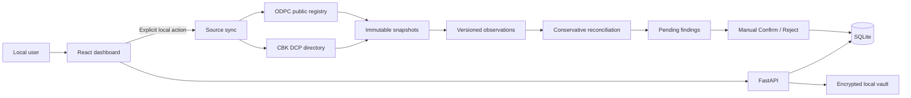

<div align="center">

# Kenya Data Rights

### Local-first regulatory intelligence and personal-data rights tooling for Kenya

[](https://github.com/MAPLEIZER/kenya-data-rights/actions/workflows/ci.yml)
[](https://github.com/MAPLEIZER/kenya-data-rights/actions/workflows/codeql.yml)


**CBK and ODPC source intelligence · immutable provenance · conservative reconciliation · manual review · privacy-first local operation**

[Quick start](#quick-start) · [How it works](#how-it-works) · [Security](#privacy-and-security-boundaries) · [Documentation](#documentation) · [Roadmap](docs/ROADMAP.md)

</div>

---

> [!IMPORTANT]
> **Kenya Data Rights is an alpha research and rights-workflow tool, not a blacklist or legal decision engine.** A record that is not matched means **“not located in the reviewed public source snapshot”**. It does not mean an institution is unregistered, unlicensed, unlawful, or non-compliant.

## What is Kenya Data Rights?

Kenya Data Rights (KDR) is an open-source, local-first platform for understanding which Kenyan institutions may hold personal or credit information, comparing authoritative public regulatory records, and building auditable personal-data rights workflows.

The first alpha focuses on **Central Bank of Kenya licensed Digital Credit Providers (DCPs)** and cross-references them against **ODPC registered data-handler observations** while keeping regulatory facts, entity matching, CRB evidence, and user-specific evidence separate.

Instead of producing a single opaque “compliant / non-compliant” answer, KDR preserves the source snapshots and shows the evidence behind each finding so a human can review it.

## Alpha at a glance

| Area | Current alpha capability |
|---|---|
| **Regulatory sources** | Fetch, snapshot and parse approved CBK and ODPC public sources |
| **Provenance** | Content-addressed immutable source snapshots with SHA-256 hashes |
| **Reconciliation** | Conservative CBK ↔ ODPC candidate matching tied to exact source records |
| **Review workflow** | Manual Confirm / Reject decisions without modifying source evidence |
| **Dashboard** | Data-backed source status, counts, sync controls and review queue |
| **Reports** | Reconciliation findings with provenance keys and conservative wording |
| **Local privacy** | SQLite by default, localhost binding and encrypted local vault primitive |
| **Mobile boundary** | Only minimal approved mapping metadata can be shared; raw communications are excluded |
| **Self-hosting** | Hardened Docker Compose deployment with non-root application containers |
| **Quality gates** | API, web, mobile-core, container smoke tests, dependency audits and CodeQL |

## What you can do now

<table>
<tr>
<td width="50%" valign="top">

### Regulatory explorer

- Sync approved CBK and ODPC sources.
- Preserve the exact source material used for analysis.
- View persisted source status and observation counts.
- Detect parser/source drift using expected-record invariants.

</td>
<td width="50%" valign="top">

### Reconciliation review

- Compare the latest CBK and ODPC snapshots.
- Review `candidate_match` findings manually.
- Inspect `not_located` findings without turning absence into an accusation.
- Confirm or reject local findings while preserving regulator evidence.

</td>
</tr>
<tr>
<td width="50%" valign="top">

### Rights-workflow foundation

- Model access, rectification, erasure, restriction and objection requests.
- Keep preview/approval ahead of eventual outbound submission.
- Maintain audit-friendly evidence boundaries.
- Keep CRB regulatory status separate from proof about a specific person.

</td>
<td width="50%" valign="top">

### Privacy-first local operation

- Run the application entirely on localhost.
- Store alpha data in a persistent local SQLite volume.
- Use an authenticated-encryption vault primitive for sensitive local material.
- Keep raw SMS bodies, call history, contacts and recordings outside the shared API contract.

</td>
</tr>
</table>

## Quick start

### Recommended: Docker Compose

Requirements: **Docker Engine / Docker Desktop with Compose v2**.

```bash
git clone https://github.com/MAPLEIZER/kenya-data-rights.git
cd kenya-data-rights
git checkout agent/alpha-0-30

docker compose -f deploy/docker-compose/compose.yaml up --build
```

Open the dashboard:

```text
http://localhost:8080
```

API health endpoint:

```text
http://localhost:8000/api/v1/health
```

The default Compose configuration binds both services to **127.0.0.1**, not the public network.

### Stop the alpha

```bash
docker compose -f deploy/docker-compose/compose.yaml down
```

> [!CAUTION]
> `docker compose -f deploy/docker-compose/compose.yaml down -v` also deletes the persistent KDR data volume, including the local SQLite database and stored source snapshots.

## How it works



### GUI workflow

1. **Overview** loads source and reconciliation counts from persisted local data.
2. **Sync sources** explicitly requests the approved CBK and ODPC alpha sources.
3. Each successful fetch is stored as an immutable snapshot before normalization.
4. Reconciliation runs only when both required alpha sources have synchronized successfully.
5. **Reports** presents findings with source keys, evidence summaries and review status.
6. **Confirm** or **Reject** changes only the local review record; regulator snapshots remain immutable.

Partial synchronization is visible. If one regulator source fails, successful source work is not silently discarded and cross-source reconciliation is not fabricated from incomplete input.

## Evidence semantics

KDR deliberately separates facts that are easy to collapse incorrectly.

| Record type | Meaning |
|---|---|
| **CBK listing** | Institution appeared in the reviewed CBK source snapshot |
| **ODPC Controller** | Controller observation appeared in the reviewed ODPC snapshot |
| **ODPC Processor** | Processor observation appeared in the reviewed ODPC snapshot |
| **candidate_match** | Evidence suggests two source records may represent the same entity; human review required |
| **not_located** | No reviewed candidate was located in the compared public snapshot |
| **confirmed / rejected** | Local reviewer decision about a reconciliation finding |
| **CRB regulatory status** | Regulatory/subscriber information about an institution |
| **subject-specific CRB evidence** | Separate evidence that an institution submitted a particular person’s information |

KDR never turns public-registry absence into an automatic legal conclusion.

## Architecture

KDR is intentionally a **modular monolith** for the alpha: simple to run locally, but separated enough to evolve without locking the project into one database or deployment shape.

```text
apps/
  api/              FastAPI, SQLAlchemy, Alembic, ingestion and review APIs
  web/              React + TypeScript + Vite dashboard
  mobile/           privacy-constrained mobile domain foundation

packages/
  regulatory_data/  source parsing, normalization and reconciliation concepts
  rights_engine/    rights-request domain logic
  identity_vault/   local encrypted identity storage boundary
  reporting/        evidence/reporting domain

sources/
  source-manifest.yaml

deploy/
  docker-compose/

docs/
  architecture, SRS, roadmap, threat model, provenance and engineering guides
```

### Data pipeline

```text
Approved public source
        |
        v
Controlled HTTPS fetch
        |
        v
Immutable SHA-256 snapshot
        |
        v
Source-specific parser
        |
        v
Versioned observations
        |
        v
Conservative reconciliation
        |
        v
Manual review + auditable report
```

## Privacy and security boundaries

The alpha is designed to make the safe path the easy path.

**Local deployment defaults**

- API and web bind to loopback only.
- Application containers run non-root.
- Filesystems are read-only except dedicated runtime/snapshot storage and temporary filesystems.
- Linux capabilities are dropped by default.
- `no-new-privileges` is enabled.
- Docker build contexts exclude `.env`, local databases, evidence, secrets and test/build output.
- Database migrations run before the API begins serving requests.

**Source-fetching controls**

- HTTPS-only approved sources.
- Manifest/host allowlisting.
- Redirects disabled.
- Response sizes bounded.
- SSRF-oriented validation.
- Snapshot-before-normalization provenance.

**Local mutation controls**

Source synchronization, reconciliation and manual review use explicit local-action headers. A regression test verifies that a foreign web origin cannot obtain CORS permission for those headers.

**Mobile/privacy boundary**

The shared server contract does **not** accept raw SMS message bodies, unrestricted call history, call duration, contacts, recordings or arbitrary device logs. Mobile contribution logic is designed to strip local communication content before user-approved minimal mapping metadata can be shared.

> [!WARNING]
> Hosted multi-user operation is intentionally deferred. Do not expose this alpha as a public service that accepts other users’ sensitive information until the roadmap’s authentication, tenant-isolation, key-management, incident-response and Kenyan compliance gates are complete.

## Current validation

The alpha branch has been validated through GitHub Actions with the following release gates:

| Gate | Result |
|---|---|
| API Ruff | **PASS** |
| API pytest | **58 passed** |
| Web tests | **PASS** |
| Web production build | **PASS** |
| Web high-severity npm audit | **PASS** |
| Mobile-core tests | **PASS** |
| Mobile-core build | **PASS** |
| Mobile high-severity npm audit | **PASS** |
| Docker Compose configuration | **PASS** |
| Docker image build | **PASS** |
| Hardened Compose startup | **PASS** |
| Direct API health check | **PASS** |
| nginx web health check | **PASS** |
| nginx → API proxy health check | **PASS** |
| CodeQL Python | **PASS** |
| CodeQL JavaScript / TypeScript | **PASS** |

See [PROJECT_STATUS.md](PROJECT_STATUS.md) for the exact implementation state and remaining public-alpha release gates.

## Run without Docker

### API

Requirements: **Python 3.12**.

```bash
cd apps/api
python -m venv .venv
source .venv/bin/activate
pip install -e '.[dev]'
uvicorn app.main:app --reload
```

On Windows PowerShell, activate the virtual environment with:

```powershell
.\.venv\Scripts\Activate.ps1
```

### Web

Requirements: **Node.js 24**.

```bash
cd apps/web
npm install
npm run dev
```

Vite proxies `/api` to the local FastAPI service, matching the nginx container path used by Docker Compose.

## Authoritative-source policy

Primary public sources are preferred. Before normalization, retrieved source material is stored with retrieval metadata and a SHA-256 content identity.

The source manifest currently defines or plans authoritative material from:

- **Central Bank of Kenya** — Digital Credit Provider directory and CRB/CIP material.
- **Office of the Data Protection Commissioner** — registered/deregistered handlers and determinations.
- **Kenya Law** — legislation and court decisions.

Source behavior can change. Parser drift, anti-bot controls and regulator-site changes are treated as observable operational conditions rather than reasons to silently weaken provenance or bypass controls.

See [sources/source-manifest.yaml](sources/source-manifest.yaml) and [docs/DATA-PROVENANCE.md](docs/DATA-PROVENANCE.md).

## Alpha limits

The following are intentionally **not** claimed as production-ready in the current release track:

- public hosted multi-user service;
- automated legal conclusions;
- indiscriminate bulk deletion campaigns;
- SMTP/IMAP request delivery and reply correlation;
- provider-specific Playwright automation;
- high-risk identity-document storage;
- restricted Android SMS / Call Log access;
- complete enforcement/court-case ingestion;
- production PostgreSQL tenant isolation and KMS-backed key management.

Before the first tagged public alpha, live CBK/ODPC field validation and reproducible dependency lock artifacts still need to be recorded. See [docs/ROADMAP.md](docs/ROADMAP.md).

## Engineering model

Changes follow a repository-level **RED → GREEN → REFACTOR** discipline:

1. define the acceptance/security contract;
2. add the failing regression test;
3. implement the smallest safe behavior;
4. refactor without weakening the contract;
5. run privacy/security review and CI gates.

Database evolution uses SQLAlchemy plus reversible Alembic migrations. See [docs/SCHEMA-EVOLUTION.md](docs/SCHEMA-EVOLUTION.md) and [docs/ENGINEERING-STANDARD.md](docs/ENGINEERING-STANDARD.md).

## Documentation

| Document | Purpose |
|---|---|
| [Project status](PROJECT_STATUS.md) | What is implemented and what remains |
| [SRS](docs/SRS.md) | Product and software requirements |
| [Architecture](docs/ARCHITECTURE.md) | System boundaries and deployment model |
| [Tech stack](docs/TECH-STACK.md) | Chosen technologies and rationale |
| [Roadmap](docs/ROADMAP.md) | 30 / 60 / 90-day delivery and go/no-go gates |
| [Threat model](docs/THREAT-MODEL.md) | Security assumptions, risks and mitigations |
| [Data provenance](docs/DATA-PROVENANCE.md) | Source authority and evidence rules |
| [Schema evolution](docs/SCHEMA-EVOLUTION.md) | Database change strategy |
| [Engineering standard](docs/ENGINEERING-STANDARD.md) | TDD and review discipline |
| [Mobile privacy](docs/MOBILE-PRIVACY.md) | Mobile contribution and permission boundary |

## Contributing

Contributions should preserve four project invariants:

1. **Evidence before conclusions.** Preserve source provenance and conservative language.
2. **Tests before fixes.** Security, parser and persistence defects require regression coverage.
3. **Privacy minimization.** Do not expand sensitive-data collection merely because a platform API makes it possible.
4. **Local-first before hosted complexity.** Hosted features must satisfy the roadmap security/compliance gates rather than weakening the local model.

Review the engineering, provenance and threat-model documentation before proposing changes that affect source ingestion, matching, identity data, request delivery or mobile permissions.

## Licence

Licensed under the **Apache License 2.0**. See [LICENSE](LICENSE).
