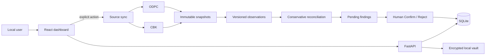

<div align="center">

# Kenya Data Rights

### Local-first regulatory intelligence and personal-data rights tooling for Kenya

[](https://github.com/MAPLEIZER/kenya-data-rights/actions/workflows/ci.yml)
[](https://github.com/MAPLEIZER/kenya-data-rights/actions/workflows/codeql.yml)


**CBK + ODPC intelligence · immutable provenance · conservative reconciliation · privacy-first local operation**

[Install](#install) · [Dashboard](#what-you-can-do) · [Android](#android-alpha) · [Security](#privacy-and-security) · [Docs](#documentation)

</div>

---

> [!IMPORTANT]
> **KDR is an alpha rights/research tool, not a blacklist or legal decision engine.** “Not located” means no sufficiently confident record was located in the reviewed public-source snapshot. It does **not** mean an institution is unregistered, unlicensed, unlawful or non-compliant.

## What is KDR?

Kenya Data Rights (KDR) is an open-source, local-first platform for understanding which Kenyan institutions may hold personal or credit information, comparing authoritative public regulatory records, and building auditable data-rights workflows.

The first alpha focuses on **CBK-licensed Digital Credit Providers (DCPs)** and cross-references them with **ODPC registered data-handler observations** while deliberately keeping these concepts separate:

```text
CBK licensed/listed institution
        ≠
ODPC Controller / Processor observation
        ≠
CRB regulatory/subscriber status
        ≠
proof a lender submitted THIS person's information
        ≠
ODPC determination
        ≠
final court outcome
```

KDR preserves the exact source evidence behind a finding instead of turning a fuzzy entity match into a legal conclusion.

## Alpha at a glance

| Area | Current alpha |
|---|---|
| **Regulatory sources** | Controlled CBK/ODPC fetch, immutable snapshots, source-specific parsing |
| **Reconciliation** | Conservative CBK ↔ ODPC candidate matching with manual Confirm/Reject |
| **Dashboard** | Data-backed source status, sync controls, review queue and reports |
| **Self-hosting** | Hardened Docker Compose, SQLite, localhost-only defaults |
| **Installer** | Themed TUI + one-file Windows/macOS/Linux executable builds |
| **Self-test** | Docker, API, dashboard, proxy, DB, manifest and snapshot-storage checks |
| **Android** | Native Compose app, Android 6.0+, permission-free + direct/private flavors |
| **Supply chain** | npm lockfiles, pip-compiled locks, CodeQL, dependency audits, deterministic Docker installs |
| **Engineering** | Repository-level test-first RED → GREEN → REFACTOR rule |

## Install

### Recommended alpha path: KDR Installer

You need **Docker Desktop** on Windows/macOS or **Docker Engine + Compose v2** on Linux. The packaged installer does not require Git, Python or Node.js.

CI builds:

```text
Windows   kdr-installer.exe
macOS     kdr-installer
Linux     kdr-installer
```

For the pre-release alpha, open the latest successful **CI** run for `agent/alpha-0-30` and download the installer artifact for your operating system. Tagged releases will publish the same binaries plus SHA-256 checksums.

Run it and you get a themed terminal menu:

```text
╭──────────────────────── Kenya Data Rights ────────────────────────╮
│ KDR Installer · local-first alpha                                │
│                                                                  │
│  1  Install / first setup     Download, build and start KDR      │
│  2  Start KDR                 Start an existing installation     │
│  3  Run self-test             Verify the complete local path     │
│  4  Open dashboard            Open http://127.0.0.1:8080         │
│  5  Show status               Show service state                 │
│  6  Update alpha              Refresh/rebuild; preserve data     │
│  7  Repair / rebuild          Rebuild; preserve data             │
│  8  Stop KDR                  Stop; preserve data                │
│  9  Uninstall                 Remove app; data purge separate    │
│ 10  Quit                                                          │
╰──────────────────────────────────────────────────────────────────╯
```

A normal **Stop**, **Update**, **Repair** or **Uninstall** preserves the persistent KDR Docker volume. Deleting the database/snapshots is a separate destructive choice with a second confirmation.

See [`docs/INSTALLATION.md`](docs/INSTALLATION.md) for the full acceptance checklist.

### Manual Docker fallback

```bash
git clone https://github.com/MAPLEIZER/kenya-data-rights.git
cd kenya-data-rights
git checkout agent/alpha-0-30
docker compose -f deploy/docker-compose/compose.yaml up --build -d
```

Then open:

```text
Dashboard       http://127.0.0.1:8080
API health      http://127.0.0.1:8000/api/v1/health
Internal test   http://127.0.0.1:8080/api/v1/system/self-test
```

## What you can do

<table>
<tr>
<td width="50%" valign="top">

### Regulatory explorer

- Sync approved CBK and ODPC sources.
- Preserve retrieved source bytes before normalization.
- Track retrieval/provenance and SHA-256 identity.
- Fail closed when expected parser/cardinality invariants drift.

</td>
<td width="50%" valign="top">

### Reconciliation review

- Compare latest CBK/ODPC observations.
- Inspect `candidate_match` and `not_located` findings.
- Confirm or reject local entity links manually.
- Keep regulator evidence immutable regardless of review decision.

</td>
</tr>
<tr>
<td width="50%" valign="top">

### Privacy-first local operation

- Local SQLite persistence.
- Loopback-only API/web bindings.
- Authenticated-encryption vault primitive.
- Non-root/read-only/capability-minimized containers.

</td>
<td width="50%" valign="top">

### Built-in self-test

- Docker CLI + daemon + Compose.
- Direct FastAPI health.
- Dashboard health.
- nginx → API proxy.
- Database + snapshot storage.
- Approved-source manifest integrity.

</td>
</tr>
</table>

## How it works



### Source → evidence workflow

1. **Overview** loads persisted local source/review counts.
2. **Sync sources** requests only manifest-approved regulator sources.
3. Source material is snapshotted before parsing/normalization.
4. Reconciliation runs only when both required alpha sources succeeded.
5. **Reports** shows provenance keys, finding semantics and review state.
6. Confirm/Reject changes local review state only; it does not rewrite source history.

## Android alpha

KDR now includes a native Kotlin + Jetpack Compose application under `apps/android`.

**Compatibility:** `minSdk 23` (Android 6.0+) · target/compile API 36.

### Two APKs, two permission boundaries

| Build | SMS / Call Log | Intended use |
|---|---|---|
| **play** | None | Permission-free Share workflow / future Play-compatible path |
| **direct** | `READ_SMS`, `READ_CALL_LOG` | Private/sideload hands-on testing |

The **direct** build does not automatically scan anything. The user must open KDR and press **Scan recent SMS & calls**. KDR then:

- requests runtime permission only at that moment;
- reads only while the activity remains foreground/resumed;
- has no SMS/call receiver, background service or scheduled communication worker;
- checks foreground state inside the provider loops and stops reads on `onPause()`;
- limits the scan to 250 SMS + 250 call rows from the last 90 days;
- does not query call duration;
- minimizes SMS bodies immediately in memory;
- retains only candidate phone identifiers/service-like labels;
- clears scan results when KDR leaves the foreground;
- does **not** upload scan-derived results in this alpha.

> [!NOTE]
> On current Android versions, SMS/Call Log permissions are hard-restricted. Depending on the device/OEM/install path, Android may refuse the grant unless the installer/eligible role allowlists it. KDR does not bypass that control; if access is refused, nothing is read and the explicit Android Share workflow remains available.

See [`docs/ANDROID.md`](docs/ANDROID.md).

## Evidence semantics

| Record | What KDR means |
|---|---|
| **CBK listing** | Appeared in the reviewed CBK snapshot |
| **ODPC Controller / Processor** | That role appeared in the reviewed ODPC snapshot |
| **candidate_match** | Evidence suggests records may represent the same entity; review required |
| **not_located** | No sufficiently confident candidate located in the compared snapshot |
| **confirmed / rejected** | A local reviewer decision about a reconciliation finding |
| **CRB regulatory status** | Institution-level regulatory/subscriber information |
| **subject-specific CRB evidence** | Separate proof concerning a particular person's data |

## Privacy and security

The alpha is designed so the safest path is the default path.

**Runtime**

- localhost-only bindings;
- non-root application containers;
- read-only container filesystems where possible;
- Linux capabilities dropped;
- `no-new-privileges` enabled;
- dedicated writable DB/snapshot directories only;
- `.dockerignore` excludes secrets, local DBs, evidence and build/test output.

**Outbound source access**

- HTTPS-only approved URLs/hosts;
- no redirects;
- response-size bounds;
- SSRF-oriented validation;
- immutable snapshot before normalization.

**Installer**

- subprocess argument vectors rather than shell strings;
- bounded source archive download/extraction;
- ZIP path traversal and symlink rejection;
- atomic update with rollback;
- destructive data deletion separated from normal uninstall.

**Android**

- Play/base flavor cannot inherit direct SMS/Call Log permissions in CI;
- direct flavor cannot add background receiver/service without CI failing;
- raw communication records are not a server API model;
- Android scan-derived community upload is disabled until explicit consent/review is implemented.

> [!WARNING]
> Do not expose this alpha as a public multi-user service accepting sensitive information. Authentication, tenant isolation, managed key storage, incident response and hosted-mode Kenyan compliance gates remain deliberately out of scope for the local alpha.

## Quality gates

The final candidate is required to pass all of these before the hands-on machine acceptance test is considered the only remaining gate:

- API locked dependency install, Ruff and pytest;
- web `npm ci`, tests, production build and high-severity audit;
- TypeScript mobile-core `npm ci`, tests/build/audit;
- installer unit/security tests + PyInstaller build on Windows, macOS and Linux;
- Android direct + Play unit tests and APK builds;
- manifest checks preventing restricted permission leakage into Play/base;
- hardened Docker Compose build/startup/direct+proxied health/internal self-test;
- CodeQL Python and JavaScript/TypeScript.

See [`PROJECT_STATUS.md`](PROJECT_STATUS.md) for the exact current gate state.

## Repository structure

```text
apps/
  api/          FastAPI + SQLAlchemy + Alembic + regulatory ingestion
  web/          React + TypeScript + Vite + Tailwind dashboard
  mobile/       platform-neutral TypeScript mobile privacy/domain core
  android/      Kotlin + Jetpack Compose native Android shell

tools/
  installer/    Rich TUI + PyInstaller cross-platform installer

packages/
  regulatory_data/
  rights_engine/
  identity_vault/
  reporting/

sources/
  source-manifest.yaml

deploy/
  docker-compose/

docs/
  architecture, requirements, security, installation and platform guides
```

## Engineering model

Changes follow a repository-level **RED → GREEN → REFACTOR** rule:

1. define the acceptance/security contract;
2. add the failing test;
3. implement the smallest safe behavior;
4. refactor without weakening the contract;
5. run privacy/security review and CI.

Schema evolution uses SQLAlchemy + reversible Alembic migrations. Destructive changes follow expand/migrate/contract rather than ad-hoc table edits.

## Documentation

| Document | Purpose |
|---|---|
| [Project status](PROJECT_STATUS.md) | Exact implemented/pending state |
| [Installation](docs/INSTALLATION.md) | Executable installer + machine acceptance test |
| [Android](docs/ANDROID.md) | Native app, flavors, permissions and device test |
| [SRS](docs/SRS.md) | Product/software requirements |
| [Architecture](docs/ARCHITECTURE.md) | Boundaries and deployment model |
| [Tech stack](docs/TECH-STACK.md) | Stack contract and rationale |
| [Roadmap](docs/ROADMAP.md) | Delivery plan and go/no-go gates |
| [Threat model](docs/THREAT-MODEL.md) | Security assumptions and mitigations |
| [Data provenance](docs/DATA-PROVENANCE.md) | Evidence/source authority rules |
| [Schema evolution](docs/SCHEMA-EVOLUTION.md) | Safe database-change strategy |
| [Engineering standard](docs/ENGINEERING-STANDARD.md) | TDD/review discipline |
| [Mobile privacy](docs/MOBILE-PRIVACY.md) | Mobile/server contribution boundary |

## What remains before the public alpha tag?

**One hands-on acceptance pass on real hardware.** It covers the pieces hosted CI cannot truthfully validate: desktop installer UX/persistence, live regulator-site behavior and Android/OEM restricted-permission behavior. See [`PROJECT_STATUS.md`](PROJECT_STATUS.md).

After that pass, any machine-specific defects are fixed, the installer's default source channel is changed from the alpha branch to `master`, PR #1 is merged, and the public alpha tag can publish installers, both APKs and `SHA256SUMS.txt`.

## Licence

Apache License 2.0 — see [LICENSE](LICENSE).
