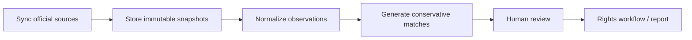
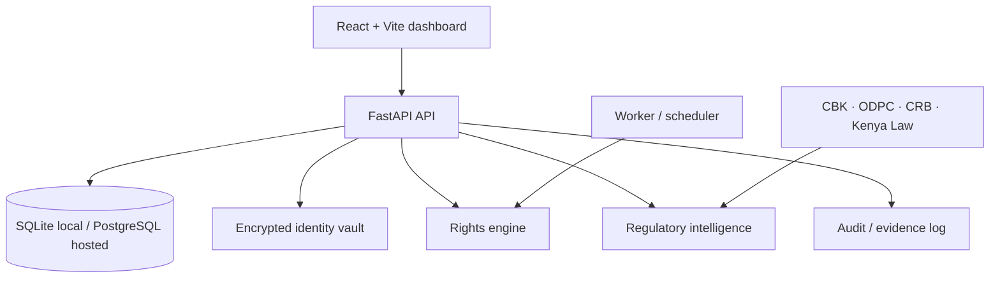

<div align="center">

# Kenya Data Rights

### Local-first privacy tooling for Kenya's digital-credit ecosystem

[](LICENSE)


**Understand which regulated institutions may hold your data, reconcile public regulator records, and prepare auditable data-rights workflows without turning regulator listings into accusations.**

[Architecture](docs/ARCHITECTURE.md) · [SRS](docs/SRS.md) · [Roadmap](docs/ROADMAP.md) · [Threat Model](docs/THREAT-MODEL.md) · [Data Provenance](docs/DATA-PROVENANCE.md)

</div>

---

> **Development status**
>
> `master` currently contains the original pre-alpha scaffold. The active 0–30 day alpha implementation is being developed and validated in [PR #1](https://github.com/MAPLEIZER/kenya-data-rights/pull/1). This README describes the product direction while clearly separating planned capabilities from what is already on the default branch.

## What is Kenya Data Rights?

Kenya Data Rights (KDR) is an open-source, local-first platform for helping people understand and exercise personal-data and credit-data rights in Kenya.

The initial focus is the **digital-credit ecosystem**: CBK-licensed Digital Credit Providers, ODPC controller/processor registrations, CRB-related evidence, regulator determinations and later court outcomes.

KDR is designed around one principle:

> **A regulator listing is evidence of regulatory status, not evidence of wrongdoing.**

The system therefore keeps these concepts separate:

| Evidence layer | What it means |
|---|---|
| CBK listing | An institution appears in the reviewed CBK source |
| ODPC registration observation | A controller/processor record appears in the reviewed ODPC source |
| CRB status | Regulatory/subscriber information related to CRB participation |
| Subject-specific CRB evidence | Evidence that a particular institution submitted a particular person's information |
| ODPC determination | A regulator decision with its own facts and procedural posture |
| Court outcome | A later judicial outcome that may affirm, vary, remit or overturn earlier findings |

An unmatched record should be reported as **"not located in the reviewed public source snapshot"** — never automatically as *unregistered*, *unlicensed* or *non-compliant*.

## Why this project exists

Most consumer privacy-removal tools are built around US/EU data brokers and people-search sites. Kenya has a different, high-value problem: consumers often interact with digital lenders, banks, CRBs, payment providers and other regulated institutions across multiple apps, brands and contact channels.

A useful Kenyan tool needs to answer questions such as:

- Which legal entity actually operates this lending app or brand?
- Is that entity listed by CBK?
- Can the same entity be located in the ODPC public registry?
- Is there CRB-related regulatory or user-specific evidence?
- Have there been ODPC determinations or court cases involving the institution?
- What data-rights request is appropriate, and what evidence supports it?

The current project research baseline uses the **9 July 2026 CBK DCP directory**, which contained **252 licensed DCP entries**. KDR is designed to store source snapshots and provenance instead of hard-coding regulatory conclusions.

## Product experience

The alpha dashboard is intentionally lightweight: a modern shadcn-compatible interface without a heavyweight admin-template dependency.

```text
┌──────────────────────────────────────────────────────────────────┐
│ Kenya Data Rights                                      Local     │
├──────────────┬───────────────────────────────────────────────────┤
│ Overview     │ Regulatory coverage                              │
│ Institutions│  CBK DCPs     ODPC records     Review queue       │
│ My Requests  │                                                   │
│ Cases        │ Source freshness + provenance                     │
│ Reports      │                                                   │
│              │ CBK ↔ ODPC reconciliation                         │
│              │ Candidate matches · Not located · Reviewed        │
└──────────────┴───────────────────────────────────────────────────┘
```

The intended workflow is simple:



No overall "compliance score" is planned. Evidence should remain inspectable and attributable to its source.

## Planned core capabilities

### Regulatory intelligence

- Version CBK Digital Credit Provider directory snapshots.
- Import ODPC registered/deregistered data-handler observations.
- Preserve regulator, source URL, publication/retrieval date and source hash.
- Reconcile legal names, trading names and aliases conservatively.
- Keep fuzzy matches in a human-review queue.
- Track CRB information separately from proof of a specific user's submission.
- Link ODPC enforcement history and Kenya Law court outcomes.

### Data-rights workflows

- Local encrypted identity profile.
- Access requests.
- Rectification requests.
- Erasure requests.
- Restriction and objection requests.
- Marketing-suppression / consent-withdrawal workflows.
- CRB dispute workflows.
- Evidence, deadline and manual-action tracking.
- Reproducible reports and exports.

### Mobile direction

A future mobile app is intended to help users identify which lender or DCP they are actually interacting with when one provider operates multiple apps, brands, sender IDs or phone numbers.

The shared-data design is deliberately conservative: raw SMS bodies, full call history, contacts and recordings should not become a central crowdsourced dataset. Classification should happen on-device where practical, with only minimal user-approved mapping evidence contributed to the shared registry.

## Architecture

KDR is designed as a **modular monolith first**. The goal is maintainable boundaries without premature microservices.



The architecture is deliberately structured so source adapters, schema migrations, matching rules and future provider automations can evolve independently.

See [docs/ARCHITECTURE.md](docs/ARCHITECTURE.md) for the full design.

## Repository layout

```text
apps/
  api/                    FastAPI application
  web/                    React/Vite dashboard
  worker/                 scheduled/background jobs

packages/
  regulatory_data/        source normalization and matching
  rights_engine/          data-rights workflow logic
  identity_vault/         local encrypted identity handling
  reporting/              exports and report generation

registry/
  cbk/
  odpc/
  crb/
  cases/

providers/
  kenya/                  provider-specific adapters

sources/
  source-manifest.yaml    authoritative-source definitions

docs/
  SRS.md
  ARCHITECTURE.md
  ROADMAP.md
  THREAT-MODEL.md
  DATA-PROVENANCE.md
  adr/
```

## Run the current scaffold locally

### Docker Compose

```bash
git clone https://github.com/MAPLEIZER/kenya-data-rights.git
cd kenya-data-rights
docker compose -f deploy/docker-compose/compose.yaml up --build
```

### API development

```bash
cd apps/api
python -m venv .venv
source .venv/bin/activate
pip install -e '.[dev]'
uvicorn app.main:app --reload
```

### Web development

```bash
cd apps/web
npm install
npm run dev
```

> The default architecture is **local-first**. Hosted multi-user operation is intentionally a later security/compliance milestone, not the default deployment mode.

## Source and evidence policy

KDR prefers authoritative primary sources. A source should be snapshotted with retrieval metadata before normalization so findings can be reproduced later.

Initial source families include:

- Central Bank of Kenya DCP directories;
- ODPC registered and deregistered data handlers;
- ODPC determinations and enforcement materials;
- CBK CRB / Credit Information Sharing material;
- Kenya Law legislation and judgments.

See [sources/source-manifest.yaml](sources/source-manifest.yaml) and [docs/DATA-PROVENANCE.md](docs/DATA-PROVENANCE.md).

## Privacy and security principles

This project may eventually handle highly sensitive identity and credit-related information, so privacy boundaries are part of the architecture rather than an afterthought.

| Principle | Direction |
|---|---|
| Local first | Self-hosting and local storage are the default |
| Data minimization | Do not collect information merely because it is available |
| Evidence provenance | Preserve where a claim came from and when it was observed |
| Human review | Ambiguous regulator/entity matches are never auto-confirmed |
| Encrypted identity data | Sensitive user profile data should be encrypted at rest |
| No raw communication crowdsourcing | SMS bodies, contacts and full call history stay outside the shared registry model |
| Conservative language | Absence from a reviewed source is not automatically a compliance finding |
| Hosted-mode gate | Do not accept other users' sensitive data until the security/compliance gates pass |

Read [docs/THREAT-MODEL.md](docs/THREAT-MODEL.md) before deploying beyond a personal test environment.

## Development approach

KDR uses a test-first engineering rule for active alpha development:

```text
Requirement / security contract
          ↓
      failing test
          ↓
 minimal implementation
          ↓
       refactor
          ↓
 privacy + security review
```

Schema evolution is intended to use explicit migrations rather than ad-hoc database mutation so the project can change safely as regulator datasets evolve.

## Roadmap

| Phase | Focus |
|---|---|
| **0–30 days** | local alpha, source ingestion, reconciliation, dashboard, security baseline |
| **31–60 days** | rights workflows, evidence handling, email/reply correlation, case imports |
| **61–90 days** | selective automation, hardened exports/backups, open-source beta |
| **Post-90** | optional hosted pilot only after security and Kenyan compliance gates |

See the complete [30/60/90-day roadmap](docs/ROADMAP.md).

## What KDR is not

KDR is **not**:

- a blacklist of lenders;
- a tool for mass harassment or indiscriminate deletion requests;
- proof that a company violated the Data Protection Act simply because records do not match;
- a substitute for legal representation;
- a justification for bypassing ODPC, CBK, Google Play or other platform/regulatory requirements.

It is intended to help users organize evidence, understand public regulatory data and exercise lawful data rights more effectively.

## Contributing

Contributions are welcome as the project matures, particularly around:

- regulator-source adapters;
- institution aliases and app-to-legal-entity mapping;
- parser fixtures and drift detection;
- Kenyan data-protection and credit-information research;
- accessibility and lightweight dashboard UX;
- security and privacy review.

Please keep regulatory assertions evidence-backed and avoid adding personal information to fixtures, issues, pull requests or CI logs.

## Documentation

| Document | Purpose |
|---|---|
| [SRS](docs/SRS.md) | functional and non-functional requirements |
| [Architecture](docs/ARCHITECTURE.md) | system structure and trust boundaries |
| [Roadmap](docs/ROADMAP.md) | staged implementation plan |
| [Threat model](docs/THREAT-MODEL.md) | security/privacy risks and controls |
| [Data provenance](docs/DATA-PROVENANCE.md) | regulator-source and matching rules |
| [ADRs](docs/adr/) | major architecture decisions |

## Licence

Licensed under the [Apache License 2.0](LICENSE).

<div align="center">

**Open source first · Local first · Evidence first**

</div>
