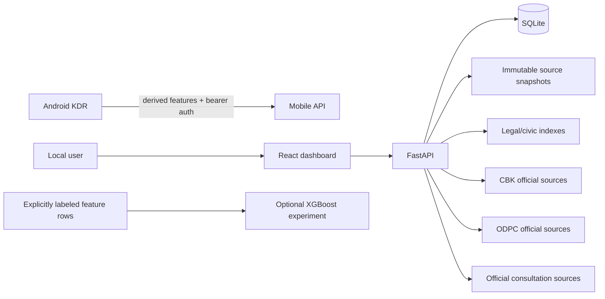

<div align="center">

# Kenya Data Rights

### Local-first privacy, regulatory intelligence and digital-rights tooling for Kenya

[](https://github.com/MAPLEIZER/kenya-data-rights/actions/workflows/ci.yml)
[](https://github.com/MAPLEIZER/kenya-data-rights/actions/workflows/codeql.yml)


**CBK + ODPC intelligence · Android DCP identification · legal teaching · civic participation · local-first privacy**

[Download](https://github.com/MAPLEIZER/kenya-data-rights/releases) · [Install](#install-in-minutes) · [Android](#android-companion) · [Legal Library](#legal-library) · [Security](#privacy--security) · [Docs](#documentation)

</div>

---

> [!IMPORTANT]
> **KDR is an alpha research/rights tool, not a blacklist or legal decision engine.** A regulator record not found in a reviewed snapshot does not automatically mean an institution is unregistered, unlicensed, unlawful or non-compliant. A message classification is evidence organization, not a legal finding.

## What is KDR?

Kenya Data Rights (KDR) is an open-source platform for understanding who may hold or use your personal/credit information, mapping digital-credit apps and sender identities to regulated providers, exercising data rights, and learning how Kenyan privacy/cyber/digital-credit law applies.

It is designed to run on **your own machine first**.

```text
CBK licensed/listed institution
        ≠
ODPC controller/processor observation
        ≠
CRB regulatory/subscriber status
        ≠
proof a lender submitted THIS person's information
        ≠
ODPC determination
        ≠
final court outcome
```

KDR preserves those distinctions throughout the data model and UI.

## Alpha at a glance

| Area | Current alpha |
|---|---|
| **Regulatory intelligence** | Controlled CBK/ODPC ingest, immutable snapshots, provenance, conservative reconciliation |
| **Dashboard** | Source status, sync, reports, manual Confirm/Reject review |
| **Legal Library** | Searchable Kenyan privacy, DCP, CRB, cybercrime, access and consumer-law teaching material |
| **Civic Participation** | Official-consultation discovery + user-reviewed memorandum/email drafts with anti-spam boundaries |
| **Android** | Android 6.0+, local loan-message classifier, Share flow, optional foreground SMS/Call Log direct build |
| **Self-hosted learning** | Android → your KDR server derived-feature telemetry; raw SMS excluded from telemetry schema |
| **ML experiments** | Optional labeled-only XGBoost training pipeline; no heavy ML runtime required on phone |
| **Installer** | Themed Windows/Linux one-file executables plus an executable-preserving macOS ZIP, self-test, updates, Android pairing |
| **Security** | Localhost defaults, restricted Tailscale mobile path, bearer auth, Keystore pairing, hardened containers |
| **Engineering** | Test-first RED → GREEN rule, Alembic migrations, CodeQL, dependency locks/audits |

# Install in minutes

## 1. Install Docker

- Windows/macOS: Docker Desktop
- Linux: Docker Engine + Compose v2

Git, Python and Node.js are **not required** for the packaged-installer path.

## 2. Download KDR

Open **[GitHub Releases](https://github.com/MAPLEIZER/kenya-data-rights/releases)** and use the latest tested alpha assets:

```text
Windows   kdr-installer-windows-x86_64.exe
macOS     kdr-installer-macos.zip
Linux     kdr-installer-linux-x86_64
Android   kdr-android-direct-alpha.apk
          kdr-android-play-alpha.apk
```

A successful newest alpha CI build is published as the rolling prerelease **`alpha-latest`**, together with `SHA256SUMS.txt`.

## 3. Run the installer

### Windows

Double-click:

```text
kdr-installer-windows-x86_64.exe
```

### macOS

1. Download and extract `kdr-installer-macos.zip`.
2. Double-click **Run Kenya Data Rights.command** inside the extracted folder.
3. If Gatekeeper warns about the unsigned alpha build, Control-click the launcher, choose **Open**, then confirm **Open**. Do not disable Gatekeeper globally.

The ZIP preserves the Unix executable metadata that a standalone browser-downloaded Mach-O release asset does not preserve reliably.

### Linux

```bash
chmod +x kdr-installer-linux-x86_64
./kdr-installer-linux-x86_64
```

Then choose **Install / first setup**.

## Installer TUI

```text
╭──────────────────── Kenya Data Rights ────────────────────╮
│ KDR Installer · local-first alpha                         │
│                                                          │
│  1  Install / first setup                                │
│  2  Start KDR                                            │
│  3  Run self-test                                        │
│  4  Open dashboard                                       │
│  5  Show status                                          │
│  6  Check / install update                               │
│  7  Update preferences                                   │
│  8  Pair Android                                         │
│  9  Open GitHub Releases                                 │
│ 10  Repair / rebuild                                     │
│ 11  Stop KDR                                             │
│ 12  Uninstall                                            │
│ 13  Quit                                                 │
╰──────────────────────────────────────────────────────────╯
```

Application updates can be **Prompt**, **Automatic**, or **Manual**. Updates and repairs preserve the persistent KDR data volume.

The installer records the exact CI-tested source commit instead of blindly tracking a moving branch.

See [`docs/INSTALLATION.md`](docs/INSTALLATION.md).

## Local dashboard

After installation:

```text
Dashboard       http://127.0.0.1:8080
API health      http://127.0.0.1:8000/api/v1/health
Internal test   http://127.0.0.1:8080/api/v1/system/self-test
```

## What you can do

<table>
<tr>
<td width="50%" valign="top">

### Regulatory explorer

- sync approved CBK and ODPC sources;
- preserve retrieved source bytes and SHA-256 provenance;
- fail closed on parser/cardinality drift;
- distinguish regulator status from subject-specific evidence.

</td>
<td width="50%" valign="top">

### Reconciliation review

- compare CBK and ODPC observations;
- inspect candidate matches and “not located” findings;
- manually Confirm/Reject links;
- preserve source evidence independently of reviewer decisions.

</td>
</tr>
<tr>
<td width="50%" valign="top">

### Legal Library

- search authoritative Kenyan privacy/cyber/DCP/CRB references;
- learn from readable chapters;
- follow official-source links and version dates;
- use message classifications to find **possible** relevant law without declaring a breach.

</td>
<td width="50%" valign="top">

### Civic Participation

- check allowlisted official government/Parliament/ODPC pages for relevant AI/cyber/privacy consultations;
- review discovery candidates;
- draft one memorandum from your own points;
- open official forms or a prefilled `mailto:` draft;
- never bulk-submit or silently send.

</td>
</tr>
</table>

# Android companion

KDR ships two Android flavors targeting API 36 with **minSdk 23 / Android 6.0+**.

### Direct/private APK

`kdr-android-direct-alpha.apk`

- explicit foreground `READ_SMS` + `READ_CALL_LOG` test flow;
- bounded recent scan;
- no SMS/call receiver or background service;
- activity foreground checks stop scans when you leave the app;
- raw message bodies are not persisted;
- local loan-message classification.

Android may refuse hard-restricted SMS/Call Log grants depending on installer/role/OEM policy. KDR does not bypass that platform control.

### Play-compatible APK

`kdr-android-play-alpha.apk`

- no SMS/Call Log permission;
- classify one message using Android **Share → Kenya Data Rights**;
- same local classifier and optional self-hosted telemetry path.

## Loan-message classifier

The lightweight `rules-v1` model runs directly on the phone and categorizes messages such as:

```text
non-loan
marketing
application
approval
loan disbursement
repayment reminder
overdue / collection
CRB notice
other loan-related
```

The feature schema is deliberately compact: scalar counts/ratios + 64 bounded hashed buckets.

### Human feedback

For model-quality protection, a human label can be attached only to **one explicitly shared message**. A bulk SMS scan cannot receive one blanket label.

The user can confirm/correct a shared message and then explicitly press **Send derived telemetry**.

## Pair Android with your Mac/self-hosted KDR

Choose **Pair Android** in the desktop installer.

KDR generates a high-entropy token and, if you choose Tailscale, exposes only:

```text
/api/v1/mobile/
```

to the Android device over Tailscale HTTPS. The dashboard/regulatory/admin surface remains localhost-only.

The Android pairing token is encrypted with Android Keystore.

Telemetry is:

- disabled by default;
- user-triggered;
- HTTPS-only in the app;
- fixed-schema derived features only;
- stored with a hashed client identifier on the server.

Raw SMS message bodies are not accepted by the telemetry API schema.

See [`docs/ANDROID.md`](docs/ANDROID.md) and [`docs/MESSAGE-CLASSIFIER.md`](docs/MESSAGE-CLASSIFIER.md).

# Optional ML training

KDR includes an **optional** server-side XGBoost experiment path. XGBoost is not installed in the normal API container or APK.

```bash
cd apps/api
pip install -e '.[ml]'
python -m app.ml.train_xgboost --output ../../local-data/models
```

Training requires at least 50 explicitly human-labeled rows and at least two classes. Rule predictions are never automatically promoted to training truth.

# Legal Library

Human-readable chapters live under [`docs/legal/`](docs/legal/README.md), backed by a machine-readable `index.json` for search and future citation-grounded AI/RAG.

Initial coverage includes:

- Constitution of Kenya — Article 31 privacy;
- Data Protection Act;
- General Regulations;
- controller/processor Registration Regulations;
- Complaints Handling & Enforcement Regulations;
- CBK Digital Credit Providers Regulations;
- CRB Regulations;
- Computer Misuse and Cybercrimes Act;
- Access to Information Act;
- Consumer Protection Act;
- Kenya Information and Communications Act.

A future legal AI assistant is expected to cite exact sources/provisions, distinguish supplied facts from inference, expose uncertainty, and avoid turning message classifications into legal findings.

# Civic Participation

KDR can discover candidate official participation notices from an allowlisted set of Kenyan public sources and surface them for review.

The submission side is intentionally constrained:

- official sources/channels only;
- no arbitrary mass-recipient list;
- max three published recipients for a consultation email channel;
- no identity fabrication;
- no automatic/bulk sending;
- closed consultations disable submission actions;
- official web forms are opened rather than botted;
- email responses are generated as a reviewable `mailto:` draft.

See [`docs/public-participation/`](docs/public-participation/README.md).

# Privacy & security

KDR treats privacy/security as core architecture rather than a later feature.

- localhost-only web/API bindings by default;
- non-root read-only containers;
- dropped Linux capabilities + `no-new-privileges`;
- `.dockerignore` protection for local secrets/evidence/databases;
- encrypted Android pairing token;
- mobile bearer authentication;
- Tailscale exposure restricted to mobile API path;
- raw communications excluded from telemetry persistence;
- source-fetch allowlists, HTTPS, no redirects and bounded downloads;
- immutable regulator snapshots;
- explicit mutation headers for local high-impact actions;
- CodeQL + dependency audit + locked dependency graphs.

See [`SECURITY.md`](SECURITY.md) and [`docs/THREAT-MODEL.md`](docs/THREAT-MODEL.md).

# Architecture



The modular-monolith design keeps schema/domain changes cheap while avoiding premature microservices.

# Engineering rule: tests before implementation

Repository changes follow:

```text
acceptance/security contract
        ↓
failing test (RED)
        ↓
minimal implementation (GREEN)
        ↓
refactor
        ↓
security/privacy review
```

Schema changes use SQLAlchemy + reversible Alembic migrations and migration round-trip tests.

# Manual Docker fallback

```bash
git clone https://github.com/MAPLEIZER/kenya-data-rights.git
cd kenya-data-rights
git checkout master
docker compose -f deploy/docker-compose/compose.yaml up --build -d
```

# Documentation

| Document | Purpose |
|---|---|
| [`docs/SRS.md`](docs/SRS.md) | Software requirements |
| [`docs/ARCHITECTURE.md`](docs/ARCHITECTURE.md) | System architecture |
| [`docs/TECH-STACK.md`](docs/TECH-STACK.md) | Technology stack contract |
| [`docs/SCHEMA-EVOLUTION.md`](docs/SCHEMA-EVOLUTION.md) | Safe schema changes |
| [`docs/INSTALLATION.md`](docs/INSTALLATION.md) | Installer/update/self-test guide |
| [`docs/ANDROID.md`](docs/ANDROID.md) | Android security/distribution |
| [`docs/ANDROID-COMPATIBILITY.md`](docs/ANDROID-COMPATIBILITY.md) | API-23 progressive features |
| [`docs/MESSAGE-CLASSIFIER.md`](docs/MESSAGE-CLASSIFIER.md) | Classifier + ML strategy |
| [`docs/legal/README.md`](docs/legal/README.md) | Searchable legal teaching library |
| [`docs/public-participation/README.md`](docs/public-participation/README.md) | Safe civic participation |
| [`docs/THREAT-MODEL.md`](docs/THREAT-MODEL.md) | Threat model |
| [`docs/DATA-PROVENANCE.md`](docs/DATA-PROVENANCE.md) | Evidence/source rules |
| [`docs/ROADMAP.md`](docs/ROADMAP.md) | Delivery roadmap |

# Current release gate

Hosted CI tests builds, migrations, containers, installers and APK generation. Real-hardware validation is still useful for Docker Desktop behavior, live regulator websites, Android OEM restricted-permission behavior and the Mac↔phone Tailscale path.

---

<div align="center">

**Open source · local first · evidence before conclusions**

</div>
