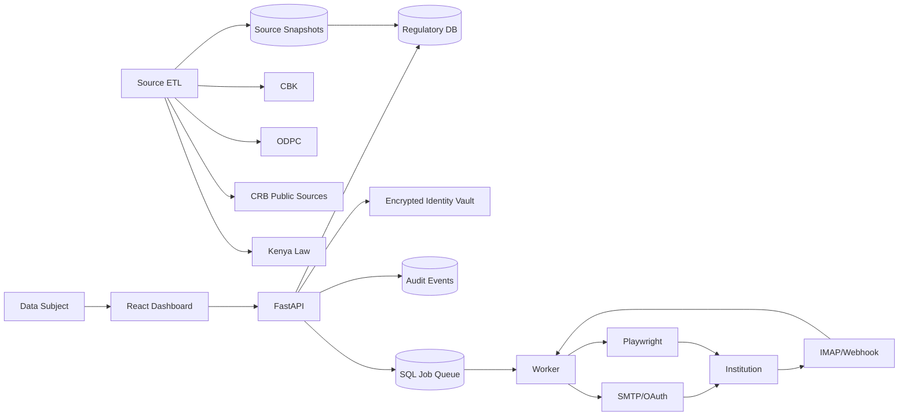
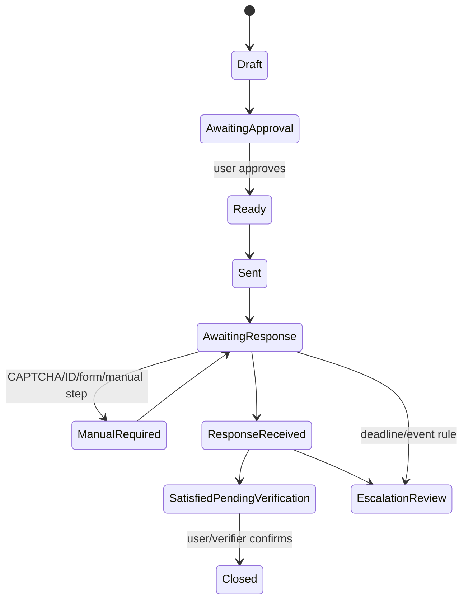

# System Architecture

## 1. Architectural decision

Build a **modular monolith** first: React/Vite frontend, FastAPI backend, SQLite local database, isolated worker process, SQL-backed jobs and Playwright only for provider-specific flows. PostgreSQL replaces SQLite in hosted multi-user mode.

No Kafka, Elasticsearch, Kubernetes or microservice mesh belongs in the MVP.

## 2. Context



## 3. Trust boundaries

### Public regulatory plane

Contains regulator and court observations that can be replicated/exported without personal identity information.

### Private identity plane

Contains encrypted user profile, request content and subject-specific CRB/evidence data.

### Browser automation plane

Processes third-party web pages and must be isolated from master secrets and full database access.

### Communication plane

Sends and receives email, hashes raw content and passes sanitized material to request workflows.

## 4. Regulatory data architecture

```text
source manifest
   -> fetch
   -> immutable snapshot + SHA-256
   -> parser version
   -> normalized observation
   -> canonical entity candidate
   -> deterministic match
   -> review candidate if fuzzy/ambiguous
   -> discrepancy/report view
```

A source observation is never rewritten into a different historical fact. New snapshots supersede only in "current view" projections.

## 5. Canonical entity model

A single institution may appear under:

- legal name;
- trading/product name;
- CBK directory name;
- ODPC controller registration;
- ODPC processor registration;
- court party name;
- CRB/CIP name.

The canonical entity UUID is therefore internal. Each external observation retains the published name and identifier.

## 6. CRB model

```text
regulated_entity
   |
   +-- regulatory_crb_status
   |      mandatory_subscriber | approved_third_party | unknown
   |
   +-- subject_crb_evidence
          bureau
          reporting_institution
          imported_at
          evidence_hash
          status: submitted_my_data | disputed | corrected | unknown
```

This prevents the false equation: "not on a public third-party list = does not report to CRBs".

## 7. Rights workflow



## 8. Identity vault

Local design target:

```text
passphrase / OS keyring secret
    -> Argon2id-derived KEK
    -> encrypt/decrypt local DEK
    -> authenticated encryption of identity payload
```

Hosted design target uses per-user random DEKs protected by KMS/Vault-held KEKs. The application database stores ciphertext and wrapped keys, not the master key.

## 9. Browser automation

Provider adapters are explicit modules. No generic "click every opt-out form" engine should be trusted to send requests automatically.

Each adapter supports:

- read-only health test;
- dry run;
- selector version;
- explicit supported rights;
- manual fallback;
- rate limit;
- CAPTCHA/manual-intervention outcome.

## 10. Mail architecture

Outbound request contains a correlation identifier. Inbound mail processing:

```text
receive -> authenticate/correlate -> preserve hash -> sanitize/extract
        -> deterministic classification -> optional assistive model
        -> confidence -> human review where uncertain -> audit event
```

## 11. Deployment profiles

### Local

- SQLite WAL
- loopback binding
- local encrypted file/evidence store
- OS keyring/passphrase
- one worker
- no telemetry

### Hosted pilot

- PostgreSQL
- Caddy/TLS
- user auth + MFA-ready admin controls
- object storage with encryption
- KMS/Vault
- isolated worker/container
- encrypted backups
- rate limits and quotas

## 12. API boundary

The frontend never accesses source files, browser workers, SMTP credentials or vault keys directly. The API exposes resource-oriented contracts; workers receive narrowly scoped jobs.

## 13. Observability

- structured logs without PII;
- source-sync success/failure and parser drift metrics;
- worker job latency/failure;
- email delivery/response events;
- no request body logging by default;
- hosted alerts for backup, queue and source-sync failures.

## 14. Migration strategy

SQLite and PostgreSQL use the same SQLAlchemy domain mappings. Schema migrations will use Alembic before the first persisted alpha dataset is considered stable.

## 15. Architectural debt intentionally deferred

- multi-region deployment;
- Kubernetes;
- distributed task broker;
- vector database;
- LLM-generated legal conclusions;
- generalized worldwide data-broker ontology.
